  

**Je construis des outils IA et data qui font gagner du temps.** 
Du document brut à la réponse sourcée, du flux Kafka au tableau de bord.

 

 

## Projets

<table>
  <tr>
    <th align="left" width="26%">Projet</th>
    <th align="left" width="44%">En une phrase</th>
    <th align="left" width="30%">Stack</th>
  </tr>
  <tr>
    <td>
      <a href="https://github.com/Rythme19/assistant-factures-rag"><b>assistant-factures-rag</b></a> 
      IA générative · RAG
    </td>
    <td>Assistant qui répond à des questions sur des factures en citant le document et la page. Données cloisonnées par client, totaux calculés en code.</td>
    <td>
      
      
      
      
      
    </td>
  </tr>
  <tr>
    <td>
      <a href="https://github.com/Rythme19/detection-fraude-scoring-ml"><b>detection-fraude-scoring-ml</b></a> 
      Machine learning
    </td>
    <td>Scoring de transactions bancaires frauduleuses sur un jeu de données très déséquilibré (0,17 % de fraudes), avec comparaison de modèles.</td>
    <td>
      
      
      
      
    </td>
  </tr>
  <tr>
    <td>
      <a href="https://github.com/Rythme19/azure-uber-streaming-platform"><b>azure-uber-streaming-platform</b></a> 
      Data engineering · Cloud
    </td>
    <td>Plateforme de traitement de courses en temps réel sur Azure. Toute l'infrastructure est déployée avec Terraform.</td>
    <td>
      
      
      
      
      
    </td>
  </tr>
  <tr>
    <td>
      <a href="https://github.com/Rythme19/uber-streaming"><b>uber-streaming</b></a> 
      Data engineering
    </td>
    <td>Pipeline temps réel : les courses arrivent dans Kafka, Spark les agrège par fenêtre de temps, Grafana les affiche.</td>
    <td>
      
      
      
      
      
    </td>
  </tr>
  <tr>
    <td>
      <a href="https://github.com/Rythme19/video-game-sales-bi"><b>video-game-sales-bi</b></a> 
      Business Intelligence
    </td>
    <td>Du fichier CSV brut au tableau de bord : nettoyage, modèle en étoile et analyse de 64 016 lignes de ventes de jeux vidéo.</td>
    <td>
      
      
      
    </td>
  </tr>
  <tr>
    <td>
      <a href="https://github.com/Rythme19/instagram-post-archiver"><b>instagram-post-archiver</b></a> 
      Automatisation
    </td>
    <td>Outil en ligne de commande qui archive des publications Instagram (images, vidéos, carrousels) et les classe par date.</td>
    <td>
      
      
    </td>
  </tr>
  <tr>
    <td>
      <a href="https://github.com/Rythme19/MERN-Dashboard"><b>MERN-Dashboard</b></a> 
      IoT · Web
    </td>
    <td>Tableau de bord de suivi d'une ferme aquacole, alimenté par des capteurs.</td>
    <td>
      
      
      
      
    </td>
  </tr>
</table>

Chaque nom mène au dépôt : code, README et commandes pour lancer le projet.

 

## Stack

  

En dehors du code : vidéo, photo et karaté.

